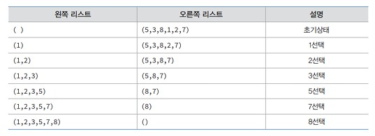
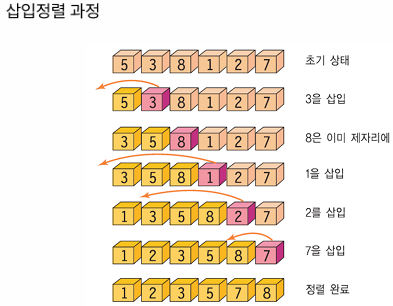
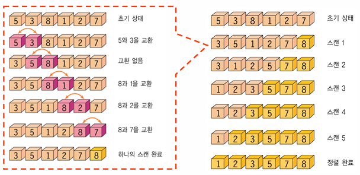
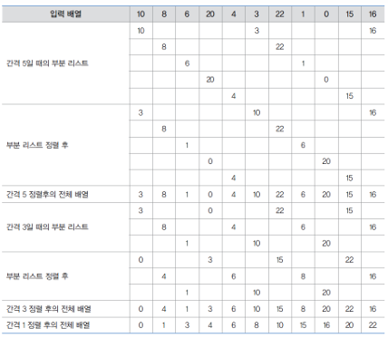
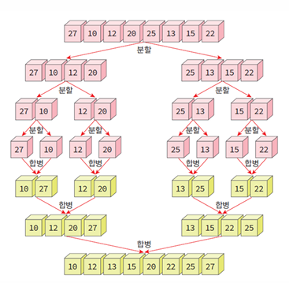
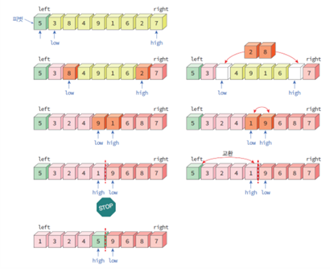
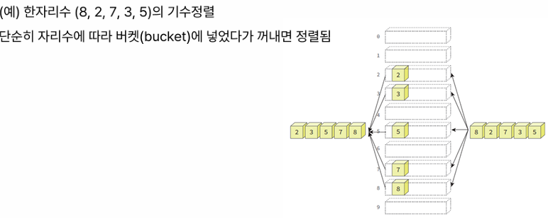
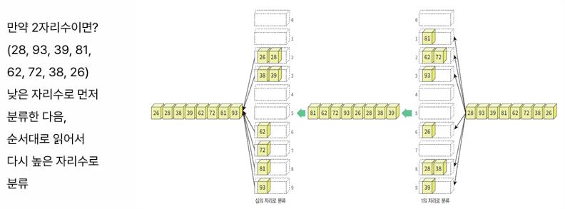
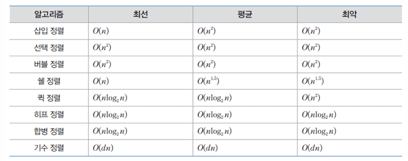

# 다양한 정렬(선택, 삽입, 버블, 쉘, 합병, 퀵, 힙)

## 정의

- 물건을 크기 순으로 오름차순이나 내림차순으로 나열하는 것
- 자료 탐색에 있어서 필수적
- 일반적으로 정렬시켜야 될 대상은 레코드(record)

## 개요

- 모든 경우에 최적인 정렬 알고리즘은 없음
- 각 응용 분야에 적합한 정렬 방법 사용해야 함
- 단순하지만 비효율적 : 삽입, 선택, 버블정렬 등
- 복잡하지만 효율적 : 퀵, 힙, 합병, 기수정렬 등
- 내부 정렬 : 모든 데이터가 주기억장치에서 저장되어진 상태에서 정렬
- 외부 정렬 : 외부기억장치에 대부분의 데이터가 있고 일부만 주기억장치에 저장된 상태에서 정렬

### 선택정렬(selection sort)

- 정렬된 왼쪽 리스트와 정렬안된 오른쪽 리스트 가정
- 초기에는 왼쪽 리스트는 비어 있고, 정렬할 숫자들은 모두 오른쪽 리스트에 존재

### 삽입정렬(insert sort)

- 정렬되어 있는 부분에 새로운 레코드를 옳은 위치에 삽입하는 과정 반복

### 버블정렬(bubble sort)

- 인접한 2개의 레코드를 비교하여 순서대로 되어 있지 않으면 서로 교환

### 쉘정렬(shell sort)

- 삽입정렬이 어느정도 정렬된 리스트에서 대단히 빠른 것에 착안
- 삽입정렬은 요소들이 이웃한 위치로만 이동하므로 많은 이동에 의해서만 요소가 제자리를 찾아감
- 요소들이 멀리 떨어진 위치로 이동할 수 있게 하면 보다 적게 이동하여 제자리 찾을 수 있음
- 전체 리스트를 일정 간격(gap)의 부분 리스트로 나눔
- 나뉘어진 각각의 부분 리스트를 삽입정렬 함

### 합병정렬(merge sort)

1. 리스트를 두 개의 균등한 크기로 분할하고 분할된 부분리스트를 정렬
2. 정렬된 두 개의 부분 리스트를 합하여 전체 리스트를 정렬

### 퀵정렬(quick sort)

- 평균적으로 가장 빠른 정렬 방법
- 분할 정복법 사용
- 리스트를 2개의 부분리스트로 비균등 분할하고, 각각의 부분리스트를 다시 퀵정렬함(재귀호출)

### 기수정렬(radix sort)

- 대부분의 정렬 방법들은 레코드들을 비교함으로써 정렬 수행
- 기수정렬은 레코드를 비교하지 않고 정렬 수행
- bucket을 이용

### 정렬 알고리즘의 비교

