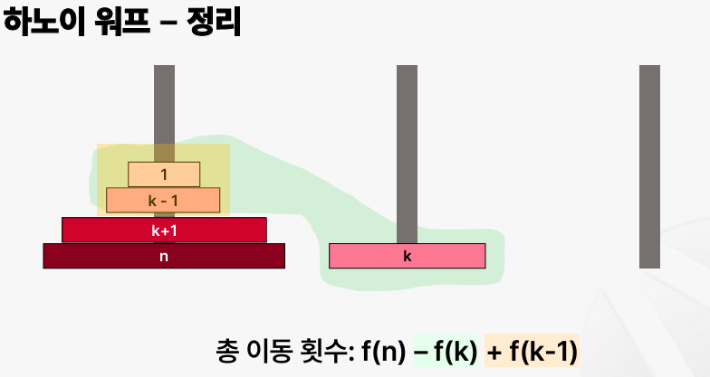

# 재귀(Recursion)

## 재귀함수 기초

- 수학에서의 함수 : 한 집합의 원소를 다른 어떤 집합의 유일한 원소에 대응시키는 이항관계
- 유일성, 정의역, 치역
- 컴퓨터에서의 함수 : 수학적 의미의 함수를 프로그래밍 언어로 구현
- 함수 외부의 상태 값(전역변수 등)이나 난수에 의해 함수의 순수서을 만족하지는 않을 수 있음
- 재귀함수에서 다루는 함수는 수학적 의미의 '순수함수'를 만족
- 함수에 동일한 매개변수(파라미터)가 입력되면 항상 동일한 반환 값을 유지
- 함수는 무한 루프에 빠지지 않고 출력 값을 반환하며 정상 종료

### 재귀함수

- 자기 자신을 호출하는 함수
- 하나의 거대한 문제를 작은 부분 문제로 분할해서 해결

### 대표적인 예 - 피보나치 수열

- i번째 항의 값은 i-1번째 항과 i-2번째 항의 합으로 나타내는 수열
- f(x) = f(x-1) + f(x-2)
- 기저 조건 : 함수를 중단시킬 조건
- f(1) = 1, f(2) = 1

### Base case

- 계산 없이 바로 답을 구할 수 있는 경우
- 재귀 호출을 멈추고 함수가 종료되는 조건
- 적어도 하나 이상의 base case가 필수로 존재

### Recursive case

- 재귀 호출이 일어나는 경우
- 문제를 작은 부분 문제로 쪼개기 위함
- 함수가 호출 될 수록 부분 문제가 base case에 수렴해야 함

## 재귀함수의 최적화

- 피보나치 수열 100번째 print 찍으면 무한 루프
- 같은 결과가 나오는 함수를 여러 번 연산하고 있음

### 피보나치 수열 최적화

- 중복되는 연산 줄여보기
- 이미 정답을 구한 함수는 연산 결과를 어딘가에 보관하고 재사용
- 최적화의 가장 기본적인 아이디어 : 입력이 [1, N]범위 라면 함수의 결과도 N개
- N개의 공간 할당 -> 배열, 리스트
- f(x)의 결과를 구한 적이 있다면 cache[x]에 저장
- f(x)를 계산하기 전에 cache[x]에 값이 있다면 계산을 수행하지 않고 cache[x]의 값을 그대로 사용

### 재귀함수를 작성하는 방법

- 귀납적 사고 : N = 1에 대해서 성립하는지 확인(Base case), N = k일때 성립한다고 가정 N = k + 1일 때 해를 [1, k]범위를 이용해서 계산
- 부분 문제 : 커다란 문제를 작은 문제로 축소

### 하노이의 탑

- f(n)은 n개의 원반을 다른 기둥으로 옮기는데 드는 횟수
- f(1) = 1, f(3)을 알고 있다고 가정했을 때
- f(4) = f(3) + 1 + f(3)
- Base case : f(1) = 1
- Recursive case : f(n) = 2 * f(n-1) + 1

### 하노이 워프

- 하노이의 탑 원판의 이동 횟수를 구하는 문제
- 임의의 원판 1개가 다른 기둥으로 이동된 상태로 시작
- 총 이동 횟수 : f(n) - f(k) + f(k-1)




## 재귀함수의 응용

### 유클리드 호제법

- 두 수의 최대 공약수를 효율적으로 구하는 알고리즘
- 약수 : 어떤 수를 나누었을 때 나누어 떨어지게 하는 수
- 공약수 : 두 개 이상의 공통된 약수
- 최대 공약수 : 두 수의 공통된 약수 중 가장 큰 수
- 최소 공약수 : 1

```text
1. 두 정수 a와 b가 있을 때 a와 b의 최대 공약수는 b와 a%b의 최대 공약수와 같음
2. B가 a%b의 공약수일 때, a%b == 0이라면 b가 최대 공약수
```

- f(a, b) →f(b, a%b) → • • • → f(c,0)
- 두번째 파라미터가 0이 될 때까지 재귀 함수를 호출
